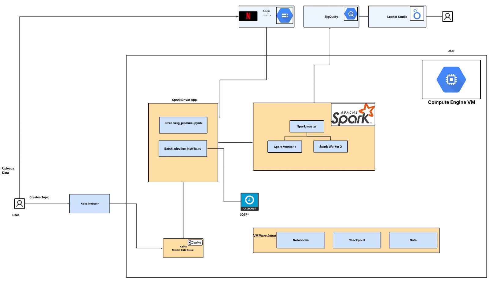
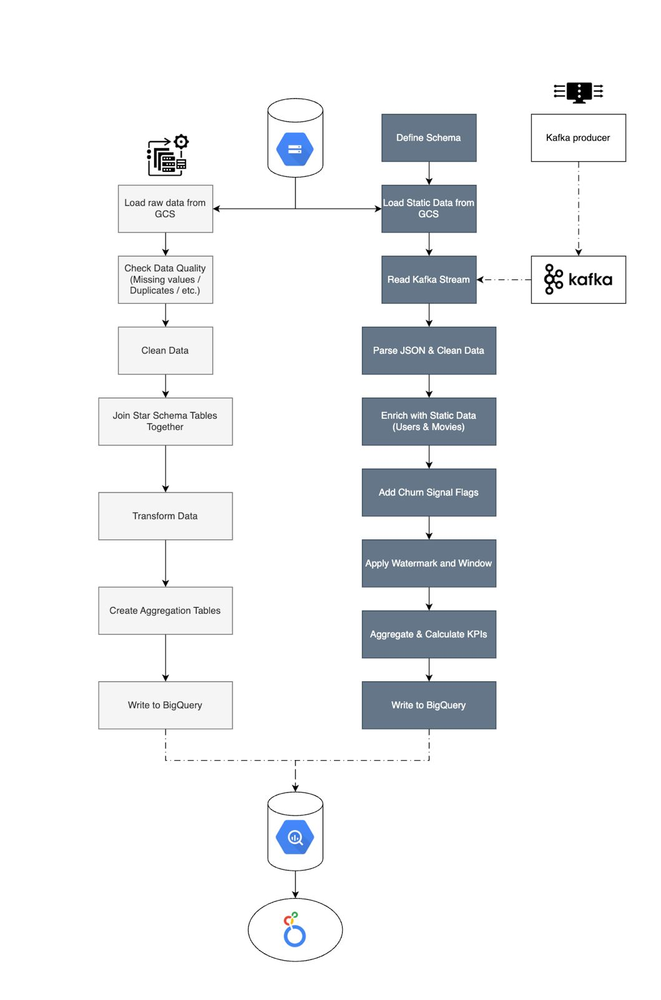
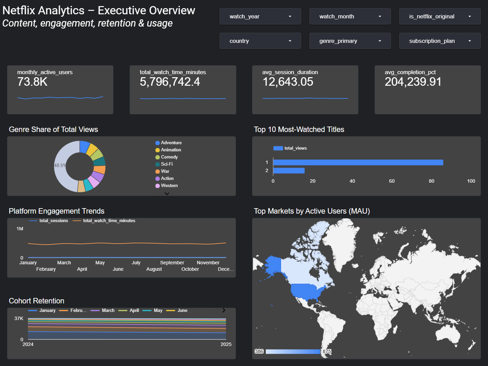

\newpage

# Overview of the Data Pipelines

## Business Context

This project designs and implements a complete data architecture and two complementary data processing pipelines for a Netflix style streaming platform. The purpose of the system is to support both real time monitoring of user engagement and robust historical trend analysis based on a comprehensive dataset describing user behaviour, content characteristics, search activity, recommendations and watch history. To achieve this, a Data Architecture is implemented in Google Cloud Platform, combining batch processing for accurate historical results with a speed layer for low latency insights.

The dataset originates from a Netflix inspired user behaviour collection available on Kaggle. It contains six interconnected tables: users, movies, watch history, reviews, search logs and recommendation logs. These tables collectively describe platform interactions across viewing sessions, content evaluation, search behaviour and recommendation responses. The dataset exhibits realistic characteristics such as missing values, duplicate entries, inconsistent timestamps and heterogeneous data types. As a result, the data pipelines must incorporate extensive data validation and cleaning procedures to ensure reliable analytical outputs.

## Project Scope

The first pipeline is a batch processing pipeline implemented in PySpark. It ingests the raw CSV files stored in a Google Cloud Storage bucket, performs data quality checks, cleans and normalises the data, constructs a star schema and produces several aggregated analytical tables. These include monthly engagement, cohort retention, content performance, genre performance and monthly active user counts. The output is stored in a dedicated BigQuery dataset and forms the foundation for historical analysis and long term performance tracking.

The second pipeline is a streaming processing pipeline implemented using Spark Structured Streaming and Apache Kafka. This pipeline processes continuous watch event data, which is simulated through JSON files ingested by a Kafka producer. Each event is enriched with static user and content data loaded from Google Cloud Storage. The streaming logic identifies churn risk signals, computes five minute windowed aggregations and maintains near real time engagement statistics. The results are written directly to BigQuery and provide a low latency monitoring capability for operational decision making.

Together, the batch and streaming pipelines operationalise the Data Architecture. They support complementary analytical objectives and enable a unified serving layer where Looker Studio dashboards combine historical and real time insights in a single analytical interface.

# Design and implementation of the data Architecture

## Architectural Overview

The data architecture implemented for this project follows a unified big data processing pattern based on the Microsoft Big Data Reference Architecture, which integrates batch and streaming processing layers using Apache Spark as a single computational engine. Unlike the traditional Lambda Architecture which requires separate processing systems, this modern approach leverages Spark's dual-mode capability to execute both historical batch analysis and real-time stream processing within the same cluster infrastructure. This architectural choice aligns with the characteristics of the Netflix-style dataset, which contains both static relational information (such as user profiles and content metadata) and dynamic behavioural data that benefits from low-latency processing. The architectural design ensures that the system can perform long-term analytical computation while simultaneously detecting short-term user behaviour patterns relevant for operational monitoring.

Apache Spark forms the computational core of the architecture. It is used to execute both high-throughput batch jobs and continuous streaming workloads in a distributed manner across a Spark master and multiple workers. Google Cloud Storage is used as the central repository for raw data, with separate folders for historical CSV files and simulated streaming JSON events. Kafka facilitates real-time event ingestion by receiving streaming messages from a custom Python producer and making them available to the Spark streaming engine. Google BigQuery acts as the unified serving layer, storing both historical aggregations and real-time metrics, supporting efficient analytical queries and dashboard creation through Looker Studio.

This unified architectural approach provides several advantages over traditional multi-system architectures: simplified operational management through a single cluster infrastructure, consistent processing logic using PySpark across both batch and streaming pipelines, efficient resource utilization through shared worker nodes, and reduced codebase complexity. The design ensures scalable, fault-tolerant, and reproducible data processing while enabling the integration of multiple data modalities and latency requirements within a cohesive framework. See the full architecture diagram at @fig-architecture.

## System Components

### Data Sources

The architecture ingests two types of data. The historical dataset stored in Google Cloud Storage consists of six CSV tables representing user profiles, content information, watch behaviour, reviews, search activity and recommendation logs. These tables form the foundation of the batch layer. In parallel, a set of JSON files is used to simulate real-time watch events. These events are published to a Kafka topic and provide the input for the speed layer.

### Streaming Layer

The streaming layer is implemented using Spark Structured Streaming, which consumes live events from the Kafka topic. Incoming events are parsed, validated and enriched by joining with static user and movie reference tables loaded from Google Cloud Storage. This hybrid use of streaming and static data enables the system to attach contextual attributes, such as country, subscription plan and genre, to each event in real-time. The streaming job applies domain-specific analysis, including detecting low-progress sessions, quality downgrades and other indicators relevant for churn-related monitoring.

The pipeline processes events using five-minute time windows with ten-second micro-batch triggers, ensuring that updates reach the serving layer with minimal latency. A watermark of ten minutes is applied to handle late-arriving data while maintaining correctness in the aggregated outputs. The resulting metrics, such as active user counts, churn signal prevalence and watch duration summaries, are continuously appended to a BigQuery streaming dataset. The diagram of this pipeline can be seen here @fig-stream-batch

### Batch Layer

The batch layer processes the complete historical dataset using a PySpark batch job executed within the same distributed Spark cluster. The job begins by loading all raw CSV tables from Google Cloud Storage and conducting data quality checks to detect missing values, schema inconsistencies and duplicate entries. Critical fields are cleaned, standardised and validated to ensure consistent downstream processing. The diagram of this pipeline can be seen here @fig-stream-batch

After cleaning, the dataset is structured into a star schema by joining the watch_history fact table with user, movie and review-based dimension information. The batch pipeline then computes several analytical constructs, including monthly engagement aggregates, cohort retention tables, genre-level performance metrics and overall monthly active user counts. These outputs are written to a dedicated BigQuery dataset and serve as the foundation for long-term historical analysis.

### Serving Layer

All processed data is stored in BigQuery. Historical outputs are written to the dataset netflix_processed, while real-time metrics are appended to netflix_streaming. This structure enables unified analytical access and supports both long-term and operational monitoring.

### Visualization Layer

The visualization layer uses Looker Studio to present both real-time and historical insights. Dashboards will integrate tables from BigQuery to display key metrics such as viewing trends, user engagement patterns, churn-related indicators and content performance comparisons. The real-time dashboard will rely on streaming outputs, while the historical dashboard will draw on batch-produced aggregates. See the figure at @fig-dashboard-netflix

## Infrastructure Setup

The entire architecture is deployed on a Compute Engine virtual machine using Docker Compose, which orchestrates all core components including Spark, Kafka, Zookeeper and a Jupyter environment for development. The VM hosts a Spark master and two Spark workers, enabling parallel execution of both batch and streaming workloads. Kafka and Zookeeper run in separate containers to manage event ingestion and cluster coordination. Docker volumes store notebooks, temporary data and checkpoint files for Spark Streaming, ensuring persistence between executions.

Google Cloud Storage acts as the external object store for raw input data, while Google BigQuery serves as the analytical warehouse for processed outputs. Cron jobs can be configured within the VM to schedule the batch pipeline at fixed intervals, further integrating the compute environment with the overall data-processing workflow. This infrastructure provides a reproducible, flexible and scalable foundation for implementing both layers of the Data Architecture. (Infrastructure diagram will be inserted here).

# Design and Implementation of the Data Pipelines

## Pipeline 1: Batch Processing Pipeline

The batch processing pipeline is designed to construct accurate, high quality analytical datasets from the historical Netflix style user behaviour data stored in Google Cloud Storage. It ingests six interconnected raw tables in CSV format, covering users, movies, watch activity, reviews, search logs and recommendation logs. After loading these tables into Spark DataFrames, the pipeline performs a structured sequence of data validation and cleaning steps. This includes detecting and removing missing values in critical identifiers, resolving schema inconsistencies, eliminating duplicate records and standardising data types such as timestamps and numeric fields.

Once the data quality procedures are applied, the pipeline constructs a star schema by joining the watch_history fact table with the user and movie dimension tables. Review information is aggregated at the user movie level and integrated to enrich content related metrics. The pipeline then performs several domain specific transformations, such as extracting dates into year month components and deriving metrics needed for time based aggregation.

To enable periodic and automated execution, the batch notebook is converted into a Python script that can be scheduled within the virtual machine using a cron job. This mechanism allows the batch pipeline to run at fixed intervals, such as every 24 hours or at shorter cycles when needed. The cron job triggers the Spark job through the Spark Driver container and ensures that updated historical metrics are continuously produced without manual intervention.

The cleaned and integrated data serves as the basis for multiple analytical outputs. These include monthly engagement statistics summarising watch time, active users and viewing behaviour across countries and subscription plans, a cohort retention model tracking user activity following their initial viewing month, and content performance tables capturing genre level patterns in viewership, ratings and watch duration. All results are written to a dedicated BigQuery dataset, where they form the historical component of the system’s analytical environment. For the diagram see @fig-stream-batch

## Pipeline 2: Streaming Processing Pipeline

The streaming processing pipeline provides real-time insights into user engagement by continuously analyzing viewing events delivered through Apache Kafka. Streaming data originates from the most recent watch history records, which are preprocessed into 30 JSON batch files containing 4,500 events using a custom Python script (prepare_streaming_data.py). These files are streamed to Kafka through a custom Python producer (kafka_producer.py) that publishes events at a controlled rate to the netflix_watch_events topic. The Spark Structured Streaming application subscribes to this Kafka topic and ingests events as an unbounded stream. Each event contains session metadata (session_id, user_id, movie_id), progress information (watch_duration_minutes, progress_percentage), device usage details (device_type, quality), and content-related attributes (action, is_download, user_rating).

The pipeline enriches each event by joining it with static user and movie data loaded from Google Cloud Storage. This enrichment incorporates user attributes such as country, subscription plan, monthly spend, age, and gender, as well as movie attributes including genre, IMDB rating, content type, and Netflix original status. Following enrichment, the pipeline applies analytical logic to detect early signs of disengagement by computing four churn signal flags: is_low_engagement (progress \< 20%), is_abandoned (stopped before 50% completion), is_quality_downgrade (SD/HD quality selection), and is_completed (full content completion).

To support near-real-time monitoring, the streaming pipeline performs time-windowed aggregations across one-hour intervals with ten-second processing triggers. A watermark of 20 minutes ensures stable handling of late-arriving events while preserving the temporal accuracy of computed metrics. For each window, the pipeline produces multi-dimensional aggregations grouped by country, genre, device type, streaming quality, content type, and Netflix original status. The computed metrics include core engagement indicators (total sessions, unique users, total watch minutes, average completion percentage), churn risk signals (low engagement count and rate, abandonment count and rate, completion count and rate), content quality metrics (average IMDB rating), and business metrics (revenue impact, average subscriber value). An alert level indicator (LOW/MEDIUM/HIGH) is assigned based on the low engagement rate threshold. The results are continuously written to the BigQuery table engagement_health_realtime using a complete output mode with overwrite strategy, ensuring the serving layer always contains the most current aggregated state for operational dashboards. For the diagram see @fig-stream-batch

# Reflection on the design and implementation of the Data Architecture and Data Pipelines

The design of the data architecture centred on the architecture model, which was selected to support both accurate historical analysis and low-latency event processing. While this approach suited the characteristics of the dataset and the project goals, an alternative design could have been a Kappa Architecture. In a Kappa-based system, all processing is carried out through a continuous streaming model, and historical results are derived by replaying events rather than maintaining a separate batch layer. This design simplifies the system by removing duplication between batch and speed layers and can reduce operational overhead. However, it would have required the availability of the historical dataset as an ordered event stream, which was not the case for this project. Moreover, the batch outputs used for monthly engagement and cohort analysis benefit from a stable and complete dataset, something that a pure streaming architecture would not provide without substantial preprocessing. Therefore, the Data Architecture offered clearer separation of responsibilities and reduced complexity at the analytical level.

Several challenges arose during implementation. One of the first issues involved selecting the correct storage location for the input data. The initial attempt involved loading data directly from BigQuery, which proved less practical for iterative development and data cleaning. Transitioning to Google Cloud Storage provided a more flexible and transparent workspace for managing raw files. This improvement was implemented after collaborative troubleshooting within the group.

A second challenge concerned ensuring that the aggregated batch outputs were correctly computed and written to BigQuery. Verifying monthly metrics and cohort retention logic required repeatedly checking intermediate transformations and confirming schema consistency. This process also required careful handling of timestamps and data types. Through systematic testing and peer discussions, the pipeline was refined to produce correct and reproducible results.

The streaming pipeline also presented difficulties, particularly in establishing a reliable connection between the Kafka producer running locally and the Kafka broker deployed within Docker. Correcting listener configurations and managing port mappings were necessary to ensure stable event delivery. Handling late-arriving data required the introduction of a watermark to prevent unbounded state accumulation while still maintaining temporal accuracy.

Overall, the implementation process highlighted the importance of designing clear data flows, validating intermediate outputs and maintaining flexibility during development. Collaboration within the group played an important role in identifying errors, adjusting architectural choices and improving the robustness of both pipelines. The final system reflects an iterative approach in which architectural decisions, debugging efforts and refinement of analytical logic contributed to a coherent and functional data processing environment.

# Individual Contributions

The Netflix data-engineering project was developed collaboratively by five group members. Responsibilities were distributed across the core components of the Data Architecture, ensuring smooth integration between infrastructure, batch processing, streaming processing and reporting.

**Rick de Rijk\
**Rick set up the project environment, including the Docker Compose configuration for Spark, Kafka and Zookeeper. He developed the batch-aggregation notebook, validated data quality outputs and ensured that historical tables were written correctly to BigQuery. Rick also assisted in testing the streaming logic, prepared the Looker Studio dashboard and coordinated the writing of the final report.

**Gilbert Laanen\
**Gilbert focused on the batch pipeline, implementing the ingestion of historical data from Google Cloud Storage, constructing the star schema and developing the monthly, cohort and content-level aggregations. He refined schema handling and supported the integration of batch outputs into the BigQuery serving layer.

**Thom Verzantvoort\
**Thom led the development of the speed layer. He configured Kafka and Zookeeper, implemented the Python-based producer for real-time events and built the Spark Structured Streaming job, including windowing, watermarking and churn-signal detection. He ensured stable ingestion into BigQuery.

**Stefan Vonk\
**Stefan contributed to debugging and validating both pipelines. He tested watermark behaviour, checkpointing and the accuracy of aggregated metrics. He supported GCS data handling, assisted with dashboard metric selection and reviewed core components of the final report.

**Tycho van Rooij\
**Tycho supported the infrastructure and pipeline testing. He helped validate the Docker Compose setup, tested the end-to-end Kafka producer–consumer flow and ensured schema consistency during event ingestion. He also verified the completeness of batch outputs and contributed to reviewing the written report.

Through this structured task allocation, the team delivered a functional Data Architecture with reproducible Spark pipelines for both historical and real-time analytics.

**Technology Statement\
**During the preparation of this work, we used ChatGPT (GPT-5.1) and Claude as support tools in order to improve the clarity of documentation, refine the structure of written sections and assist in resolving technical questions related to Spark, Kafka and Docker configuration. The following parts of the assignment were affected by AI-assisted usage: the description of the data architecture design, the explanation of the batch and streaming pipelines and the refinement of the written report sections. After using these tools, Rick de Rijk, Thom Verzantvoort, Tycho van Rooij, Stefan Vonk and Gilbert Laanen evaluated the validity of all outputs, verified correctness based on our own implementation and edited the content as needed. As a consequence, the authors take full responsibility for the accuracy and completeness of the content of this work.

\newpage

# References

Sayeeduddin. (2025). Netflix 2025 user behavior dataset (210k records) \[Data set\]. Kaggle.[ https://www.kaggle.com/datasets/sayeeduddin/netflix-2025user-behavior-dataset-210k-records/data](https://www.kaggle.com/datasets/sayeeduddin/netflix-2025user-behavior-dataset-210k-records/data)

\newpage

# Appendix

{#fig-architecture}

{#fig-stream-batch}

{#fig-dashboard-netflix}
